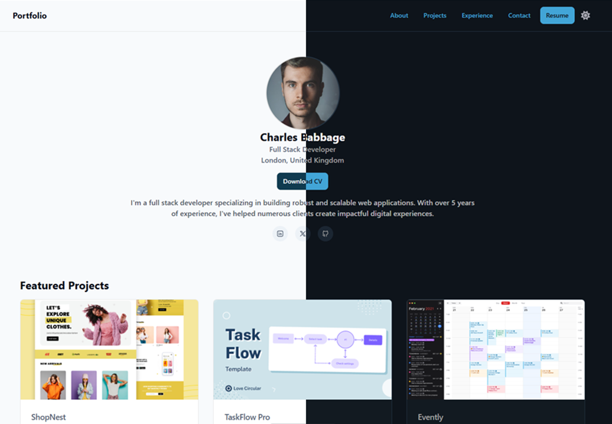

# OrbitUI Portfolio Template

A professional portfolio template built with [Astro](https://astro.build/), [Tailwind CSS](https://tailwindcss.com/), and pre-designed components from the [OrbitUI](https://orbitui-docs.vercel.app/) library.



## Getting Started

Follow these steps to get your portfolio up and running locally.

### Prerequisites

Make sure you have Node.js (version 20 or higher) installed on your machine, along with a package manager, preferably pnpm.

### Installation

#### 1. Fork this repository

Click the "Fork" button in the upper right corner of GitHub to create your own copy of this repository.

#### 2. Clone this repository

```bash
git clone <repo-url>
cd orbitui-portfolio-template
```

#### 3. Install dependencies

```bash
pnpm install
```

#### 4. Start the development server

```sh
pnpm dev
```

This will start the development server at [http://localhost:4321](http://localhost:4321) .

## Personalización

- Edit the files in `src/components/sections/` to modify the portfolio sections (Hero, Projects, Skills, etc).
- Change the global styles in `src/styles/global.css`.
- Use and combine OrbitUI components located in `src/components/ui/` create new sections or modify existing ones.

## OrbitUI Components

Explore the OrbitUI documentation to see all available components and how to use them. Simply import them into your .astro files and customize their props as needed.

## Project Structure

```text
├── public/                # Static files (images, favicon, etc)
├── src/
│   ├── components/
│   │   ├── sections/      # Main portfolio sections
│   │   └── ui/            # Reusable OrbitUI components
│   ├── layouts/           # Base layouts
│   ├── pages/             # Astro pages
│   └── styles/            # Global styles
├── astro.config.mjs       # Astro configuration
├── orbit.config.mjs       # OrbitUI configuration
├── package.json           # Dependencies and scripts
└── tsconfig.json          # Typescript configuration
```

## Credits

- [Astro](https://astro.build/)
- [Tailwind CSS](https://tailwindcss.com/)
- [OrbitUI](https://orbitui-docs.vercel.app/)

## Usage and Contribution

You can use this template to create your own personal portfolio without restrictions. If you find this template useful and would like to support me, consider giving this repository a star on GitHub!

---

Customize, deploy, and share your professional portfolio in minutes!
